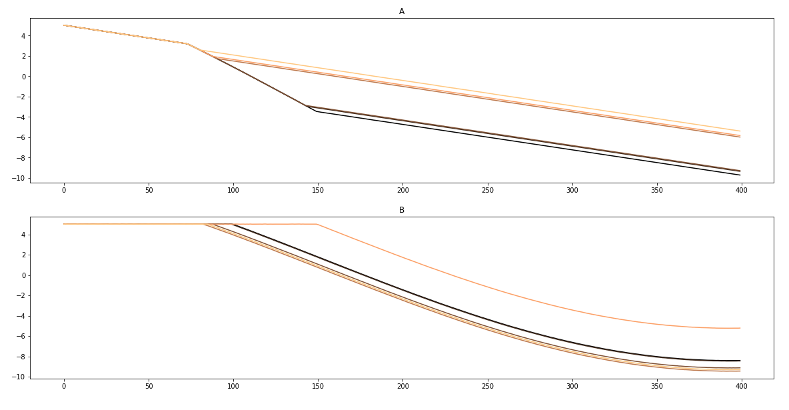
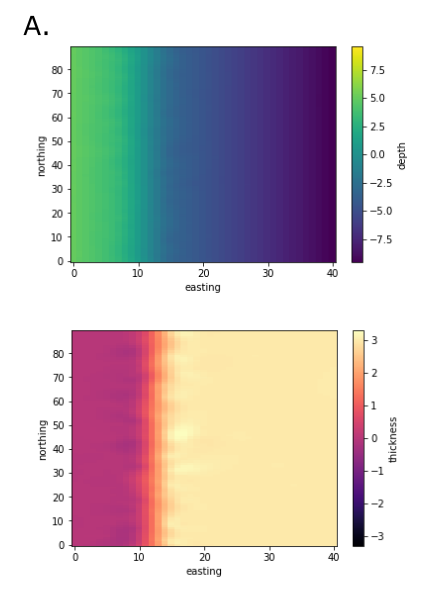
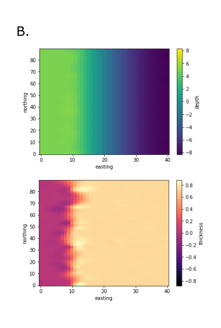

# Ambiguous Maps
We often look at structure and thickness maps to infer subsurface geometries.
Unfortunately, unconformities can appear to have the same map patterns as
onlap. This notebook looks at the similarities in map patterns for both
angular unconformities and onlap. It creates structure and isochore maps as
well as a cross-section that you can decimate to see how similar cross-sections
can look with in a sparse well environment.

